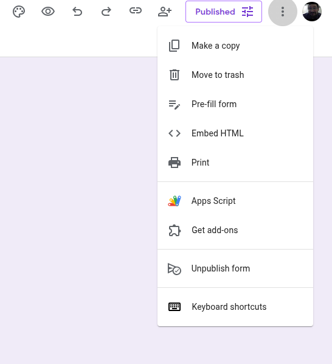
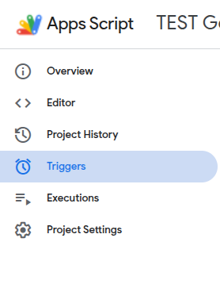

# Google Form POSTing

Sometimes there are cases where the Portal will need to receive in near-realtime Google Form submissions.
This page will explain how to setup Google Forms to POST submissions to a Portal endpoint.

The following was adapted from [this online article](https://medium.com/@eyalgershon/sending-a-webhook-for-each-google-forms-submission-a0e73f72b397).

## Setup Your Google Form

Setup the Google Form that will be pushed on each user submission. Don't forget to _Publish_.

## Create Default Google Apps Script

On the top right three-dot menu of the Form (in admin mode) there is an entry for Google Apps Script.



Once opened, make sure to name the Project at the top.

### Add Custom Function to Google Apps Script

Within the Apps Editor (`<>`), you will see

```javascript
function myFunction() {}
```

Replace with

```javascript
const POST_URL =
  "https://drgbh3hrliz1t.cloudfront.net/portal/access/application";
const TOKEN = "QWERTYQWERTY";
const LABNAME = "smce-prod-opensarlab";

function onSubmit(e) {
  var form = FormApp.getActiveForm();
  var allResponses = form.getResponses();
  var latestResponse = allResponses[allResponses.length - 1];
  var response = latestResponse.getItemResponses();
  var headers = {
    Authorization: "Basic " + TOKEN,
    "X-OSL-LABNAME": LABNAME,
  };
  var payload = {};
  for (var i = 0; i < response.length; i++) {
    var question = response[i].getItem().getTitle();
    var answer = response[i].getResponse();
    payload[question] = answer;
  }

  var options = {
    method: "post",
    contentType: "application/json",
    payload: JSON.stringify(payload),
    headers: headers,
  };

  UrlFetchApp.fetch(POST_URL, options);
}
```

Here the following will need to be updated for the particular situation:

- POST_URL: The Portal url to POST Form submissions
- TOKEN: A token used in the Authorization header.
- LABNAME: The lab short name for the form's assigned lab.

Don't forget to save. However, you do not need to run or _Deploy_ the code. It is automatically available to the form.

### Create a trigger for auto-POSTing

Though the code is available, we need to set up a trigger so that javascript function is executed on form submission.

Go to the Apps Triggers menu on the left.



Click the `+ Add Trigger` button on the bottom right.

From the popup dialog box, keep all the default settings except for _Select event type_. Change that value to _On Form Submit_ and save.

A popup box will ask for permission to access the Google Account. Allow.

There is nothing else that needs to be done to set up a trigger. You do not need to click _Deploy_.

Any form submissions will run the Apps code on submit. The code will POST the form answers to the given Portal endpoiont.

## Setup Portal Endpoint

Example code of the Portal endpoint. Actual code will need to be placed in the proper router.

```python
@access_router.post("/application", include_in_schema=False)
def post_application():
    auth_header = access_router.current_event.headers.get("Authorization", None)
    labname_header = access_router.current_event.headers.get("X-OSL-LABNAME", None)
    body = access_router.current_event.body

    logger.info(
        f"APPLICATIONS: {auth_header} {labname_header} {body}"
    )

    return 200
```

Since the POST is a normal HTTP action, we can use an `Authorization` header for authentication.
This is important since the endpoint itself needs to be publicly available but we don't need other actors to push fake applications.

The custom `X-OSL-LABNAME` header will contain the lab name assigned to the form.
This allows for multiple forms to be made for multiple labs.

The `body` of the event will be the json formatted answers to the form.

## Logs and Metrics

The Google App menu item `Overview` will show the number of users and triggered executions.

The Google App menu item `Executions` will show a log of all trigger executions.
