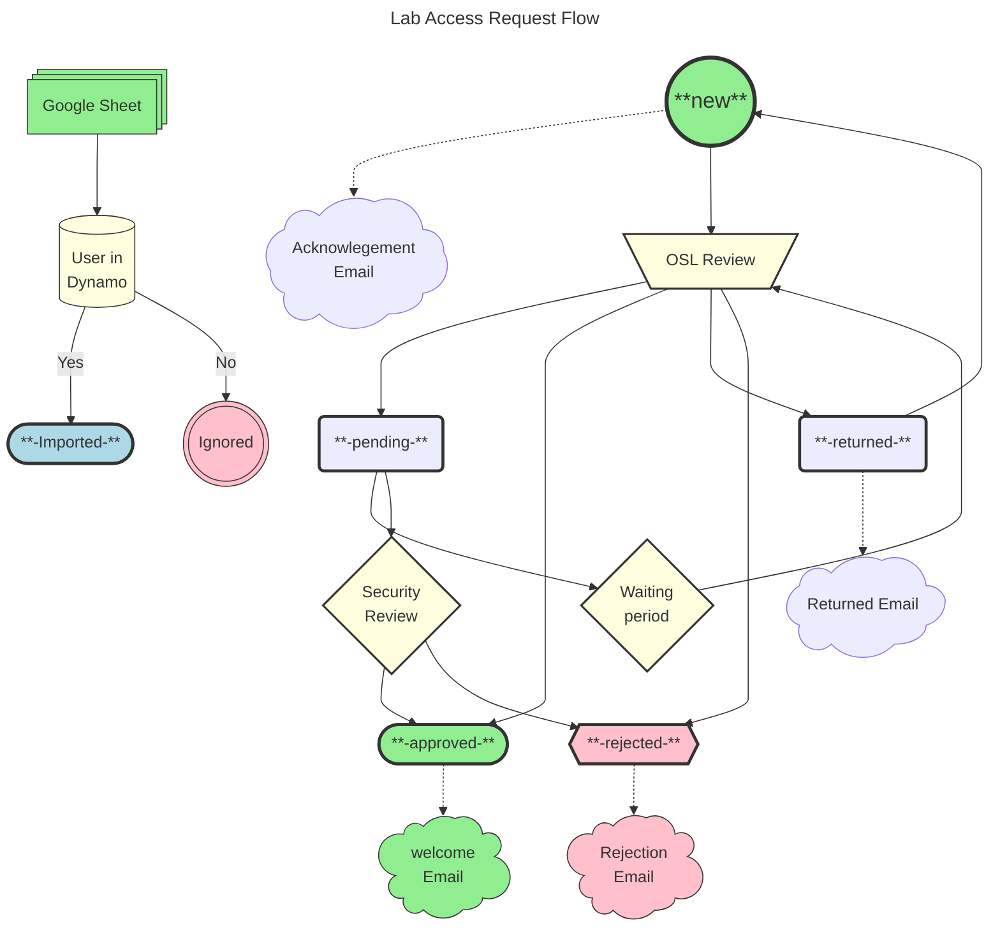

# Lab Access request flow

```mermaid
---
title: Lab Access Request Flow
config:
  theme: default
  flowchart:
    curve: monotoneY
---
flowchart TD
    style A fill:lightgreen,stroke:#333,stroke-width:4px,font-size:16pt
    style B stroke:#333,stroke-width:3px
    style D stroke:#333,stroke-width:3px
    style E fill:pink,stroke:#333,stroke-width:3px
    style H fill:pink,stroke:#333,stroke-width:1px
    style I fill:lightgreen,stroke:#333,stroke-width:1px
    style C fill:lightgreen,stroke:#333,stroke-width:3px
    style F fill:lightyellow,stroke:#333,stroke-width:2px
    style K fill:lightyellow,stroke:#333,stroke-width:2px
    style A1 fill:lightyellow,stroke:#333,stroke-width:2px
    style Z fill:lightgreen,stroke:#333,stroke-width:1px
    style Y fill:lightyellow,stroke:#333,stroke-width:1px
    style X fill:lightblue,stroke:#333,stroke-width:3px
    style W fill:pink,stroke:#333,stroke-width:1px
    Z@{ shape: procs, label: "Google Sheet"}
    Z --> Y@{ shape: cyl, label: "User in<br>Dynamo" }
    Y --Yes--> X(["**-Imported-**"])
    Y --No --> W@{ shape: dbl-circ, label: "Ignored" }
    A -.-> J@{ shape: cloud, label: "Acknowlegement<br>Email"}
    A(("**new**")) --> A1@{ shape: trap-t, label: "OSL Review" }
    A1 --> B("**-pending-**")
    B --> K{"Waiting<br>period"}
    K --> A1
    A1 --> C(["**-approved-**"])
    A1 --> D("**-returned-**")
    D -.-> L@{ shape: cloud, label: "Returned Email"}
    A1 --> E{{"**-rejected-**"}}
    B --> F{Security<br>Review}
    F --> C
    F --> E
    D --> A
    E -.-> H@{ shape: cloud, label: "Rejection<br>Email"}
    C -.-> I@{ shape: cloud, label: "welcome<br>Email"}
```
